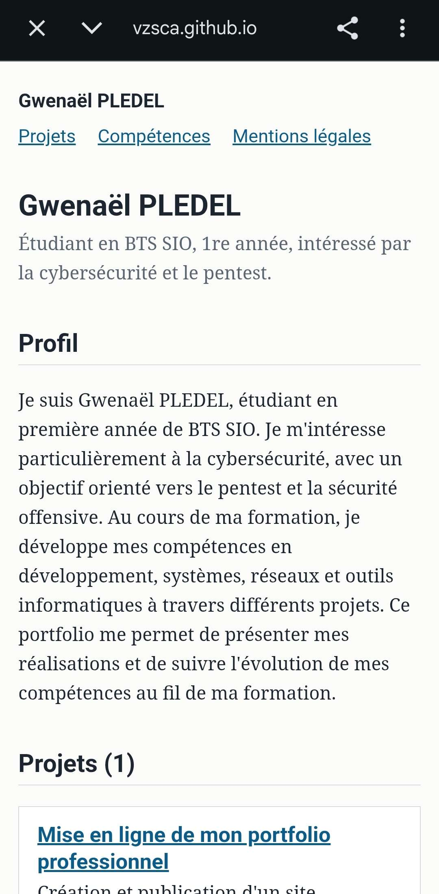

## Contexte

Pour l'épreuve E5 et pour ma recherche de stage, j'ai besoin d'une adresse unique qui présente mes réalisations et que je complète au fil de l'année. Ce portfolio me permet également de présenter les compétences développées pendant ma formation en BTS SIO.

## Conditions et moyens

Travail individuel réalisé dans le cadre de la formation BTS SIO. J'ai utilisé un ordinateur, un navigateur web, un compte GitHub gratuit et le modèle de portfolio BTS SIO basé sur Jekyll et GitHub Pages. J'ai également utilisé W3C Validator et Lighthouse pour vérifier le site.

## Description de l'activité

1. Création du dépôt à partir du modèle (bouton « Use this template »).
2. Réglage de l'identité du site dans le fichier `_config.yml`.
3. Personnalisation de la page d'accueil et du profil.
4. Activation de GitHub Pages sur la branche `main`.
5. Rédaction des mentions légales : éditeur, hébergeur, absence de collecte de données.
6. Vérification sur ordinateur et sur téléphone, puis contrôle de l'accessibilité.

## Productions et preuves

- L'adresse publique du site.
- Le dépôt et son historique des modifications.
- La page de profil et les informations de contact.
- Les mentions légales.
- Les contrôles W3C et Lighthouse.
- Les captures de vérification du site et de sa publication.

### Captures

**Affichage sur ordinateur**

**Publication GitHub Pages**

**Affichage sur mobile**

## Ce que j'en retiens

La mise en ligne du portfolio m'a permis de comprendre le fonctionnement d'un site statique avec Jekyll et GitHub Pages. J'ai également appris à organiser mes réalisations et à les associer aux compétences du BTS SIO afin de pouvoir suivre mon évolution pendant la formation.
